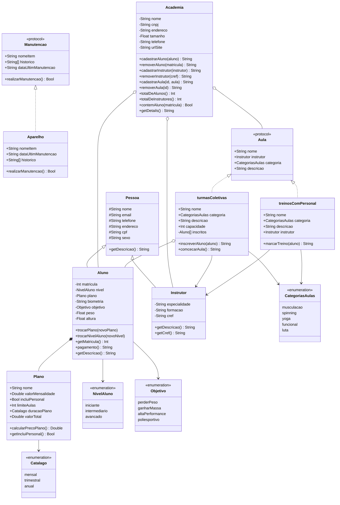

```mermaid
classDiagram
    class Pessoa {
        #String nome
        #String email
        #String telefone
        #String endereco
        #String cpf
        #String sexo
        +getDescricao() String
    }

    class Aluno {
        -Int matricula
        -NivelAluno nivel
        -Plano plano
        -String biometria
        -Objetivo objetivo
        -Float peso
        -Float altura
        +trocarPlano(novoPlano)
        +trocarNivelAluno(novoNivel)
        +getMatricula() Int
        +pagamento() String
        +getDescricao() String
    }

    class Instrutor {
        -String especialidade
        -String formacao
        -String cref
        +getDescricao() String
        +getCref() String
    }

    class Plano {
        +String nome
        +Double valorMensalidade
        +Bool incluiPersonal
        +Int limiteAulas
        +Catalago duracaoPlano
        +Double valorTotal
        +calcularPrecoPlano() Double
        +getIncluiPersonal() Bool
    }

    class Aparelho {
        +String nomeItem
        +String dataUltimManutencao
        +String[] historico
        +realizarManutencao() Bool
    }

    class turmasColetivas {
        +String nome
        +CategoriasAulas categoria
        +String descricao
        +Int capacidade
        -Aluno[] inscritos
        +inscreverAluno(aluno) String
        +comcecarAula() String
    }

    class treinosComPersonal {
        +String nome
        +CategoriasAulas categoria
        +String descricao
        +Instrutor instrutor
        +marcarTreino(aluno) String
    }

    class Academia {
        -String nome
        -String cnpj
        -String endereco
        -Float tamanho
        -String telefone
        -String urlSite
        +cadastrarAluno(aluno) String
        +removerAluno(matricula) String
        +cadastrarInstrutor(instrutor) String
        +removerInstrutor(cref) String
        +cadastrarAula(id, aula) String
        +removerAula(id) String
        +totalDeAlunos() Int
        +totalDeInstrutores() Int
        +contemAluno(matricula) Bool
        +getDetails() String
    }

    class Manutencao {
        <<protocol>>
        +String nomeItem
        +String[] historico
        +String dataUltimManutencao
        +realizarManutencao() Bool
    }

    class Aula {
        <<protocol>>
        +String nome
        +Instrutor instrutor
        +CategoriasAulas categoria
        +String descricao
    }

    class NivelAluno {
        <<enumeration>>
        iniciante
        intermediario
        avancado
    }

    class Objetivo {
        <<enumeration>>
        perderPeso
        ganharMassa
        altaPerformance
        poliesportivo
    }

    class CategoriasAulas {
        <<enumeration>>
        musculacao
        spinning
        yoga
        funcional
        luta
    }

    class Catalago {
        <<enumeration>>
        mensal
        trimestral
        anual
    }

    Pessoa <|-- Aluno
    Pessoa <|-- Instrutor
    Manutencao <|.. Aparelho
    Aula <|.. turmasColetivas
    Aula <|.. treinosComPersonal
    Aluno *-- Plano
    Academia o-- Aluno
    Academia o-- Instrutor
    Academia o-- Aula
    turmasColetivas o-- Aluno
    turmasColetivas --> Instrutor
    treinosComPersonal --> Instrutor
    Aluno --> NivelAluno
    Aluno --> Objetivo
    Plano --> Catalago
    turmasColetivas --> CategoriasAulas
    treinosComPersonal --> CategoriasAulas
```
